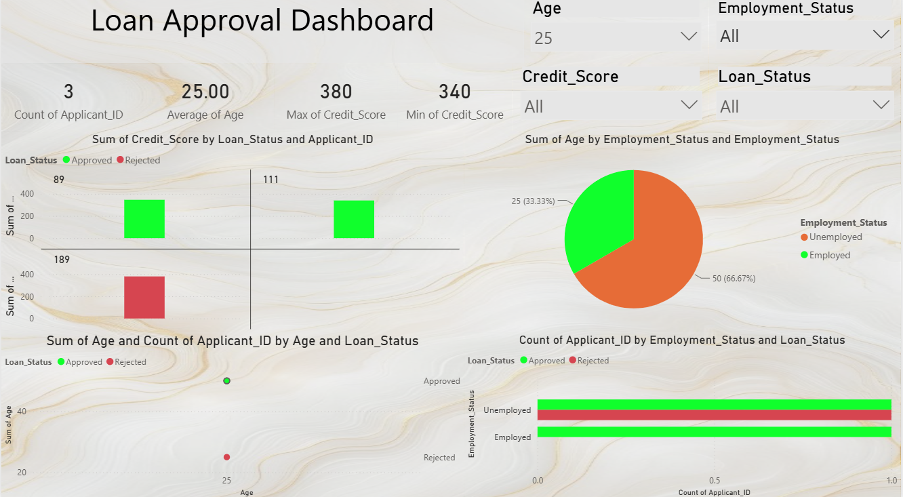

<div align="center">

# 🏦 Loan Approval Analytics Dashboard

### Credit Risk & Loan Decision Intelligence with Power BI

*A Power BI dashboard designed to analyze loan applicant data, evaluate approval patterns, and uncover the factors influencing lending decisions through interactive business intelligence and risk analytics.*


</div>

---

# 📖 Overview

Financial institutions rely on data-driven lending decisions to balance business growth with risk management.

This project demonstrates how Power BI can transform loan applicant data into an interactive dashboard that enables analysts to explore approval trends, assess applicant characteristics, and identify the variables associated with loan approval or rejection.

The dashboard combines interactive visualizations, KPI monitoring, and applicant analytics to support better credit risk assessment and lending decisions.

---

# 📸 Dashboard Preview

<p align="center">

</p>

---

# ✨ Dashboard Features

## 📋 Executive KPIs

Monitor key lending metrics including:

- Total Applicants
- Average Applicant Age
- Maximum Credit Score
- Minimum Credit Score

---

## 🏦 Loan Approval Analysis

Explore:

- Approved vs Rejected Applications
- Applicant Distribution
- Approval Patterns
- Lending Outcomes

---

## 👤 Applicant Demographics

Analyze applicant characteristics including:

- Age Distribution
- Employment Status
- Credit Score Distribution
- Loan Status

---

## 📈 Credit Risk Insights

Visualize:

- Credit Score vs Approval
- Applicant Risk Profiles
- Employment Impact
- Approval Trends

---

## 🎛 Interactive Exploration

Dynamic slicers allow filtering by:

- Age
- Employment Status
- Credit Score
- Loan Status

---

# 📊 Key Business Insights

### 📋 Applicant Overview

The dashboard provides a comprehensive overview of applicant demographics, employment status, and credit profiles, enabling quick assessment of the lending portfolio.

---

### 💳 Credit Score Analysis

Applicants with approved loans generally demonstrate strong credit profiles. However, isolated exceptions highlight that credit score alone is not sufficient for lending decisions and should be evaluated alongside additional applicant characteristics.

---

### 👤 Employment Analysis

The applicant pool is predominantly composed of unemployed applicants, while both employed and unemployed individuals appear across approved and rejected loan categories.

This indicates that employment status contributes to lending decisions but is not the sole determining factor.

---

### 📈 Approval Patterns

The dashboard suggests that loan approval is influenced by multiple variables rather than any single metric, reflecting the multifactor nature of real-world credit risk assessment.

---

# 🛠 Tools & Technologies

| Category | Technology |
|-----------|------------|
| Dashboard | Power BI |
| Calculations | DAX |
| Data Modeling | Power Query |
| Visualization | Interactive Charts |
| Analytics | Credit Risk Analytics |

---

# 📈 Dashboard Components

| Dashboard Element | Purpose |
|-------------------|----------|
| KPI Cards | Executive lending overview |
| Scatter Plot | Credit Score vs Loan Status |
| Bar Chart | Employment Status Analysis |
| Pie Chart | Applicant Distribution |
| Interactive Filters | Dynamic exploration |
| Applicant Analytics | Demographic analysis |

---

# 🎯 Business Questions Addressed

The dashboard helps answer questions such as:

- Does credit score significantly influence loan approval?
- Does employment status impact lending decisions?
- What is the demographic profile of loan applicants?
- Are rejected applicants concentrated within specific risk groups?
- Which applicant characteristics are most strongly associated with approvals?
- How can lenders better understand their applicant portfolio?

---

# 🚀 Skills Demonstrated

- Power BI Dashboard Development
- Credit Risk Analytics
- DAX Measures
- Interactive Reporting
- KPI Development
- Financial Data Analysis
- Data Visualization
- Executive Reporting
- Business Intelligence
- Data Storytelling

---

# 📂 Repository Structure

```
Loan-Approval-Dashboard
│
├── Loan Approval Dashboard.pbix
├── loan-approval-screenshot.png
└── README.md
```

---

# 💡 Why This Project?

Loan approval is a complex decision-making process that depends on multiple applicant characteristics rather than a single factor.

This dashboard demonstrates how Power BI can be used to explore lending data, identify approval patterns, and communicate insights through interactive visualizations that support credit analysts, financial institutions, and business stakeholders in making more informed lending decisions.
